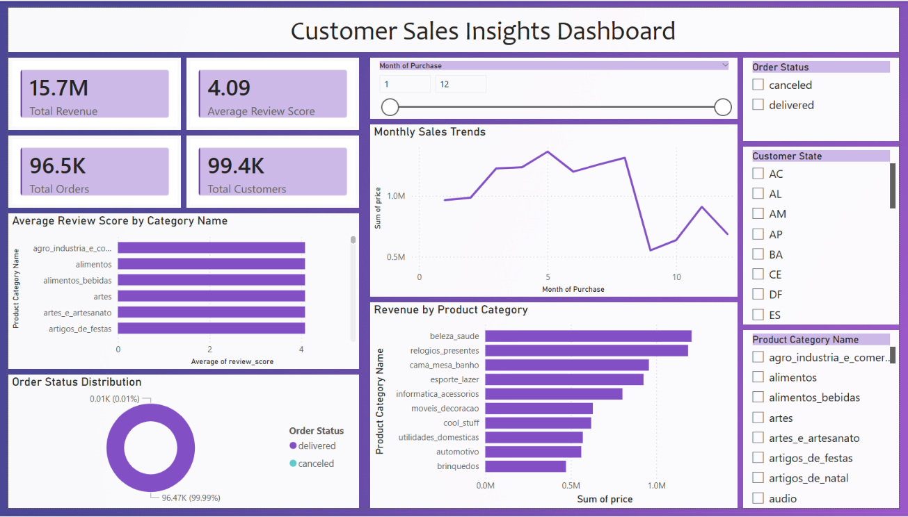

# Customer and Sales Insights using SQL
# Project Overview 
This project focuses on cleaning, transforming, analyzing and visualizing customer sales dataset using SQL Server and Power BI. The objective of this project to extract meaningful business insights related to sales performance, customer behavior, product categories, and order trends.
The project demonstrated a complete end-to-end data analytics workflow including:
1. Data cleaning
2. Data Transformation
3. Exploratory Data Analysis (EDA)
4. Business Insights Generation
5. Interactive Dashboard Visualization
# Tools & Technologies Used
1. SQL Server
2. T-SQL
3. Power BI
# Dataset Tables Used
1. Customers Data
2. Orders Data
3. Order Items Data
4. Order Payment Data
5. Order Reviews Data
6. Products Data
# Data cleaning Process
The following data cleaning operations were performed:
1. Checked and handled duplicate records using ROW_NUMBER() and CTEs
2. Identified and handled missing/null values
3. Converted incorrect data types into appropriate formats
4. Standardized product category values
5. Created cleaned tables for analysis
# Cleaned tables Created:
1. Cleaned_customer_data
2. cleaned_orders_data
3. cleaned_order_items_data
4. cleaned_order_payment_data
5. cleaned_reviews_data
6. cleaned_products_data
# Exploratory Data Analysis (EDA)
1. Total Revenue Analysis
2. Revenue by City
3. Revenue by Product Category
4. Order Status Distribution
5. Customer Review Analysis
6. Monthly Sales Trend
7. Top Customer Analysis
# Power BI Dashboard
An interactive Power BI dashboard was created to visualize key business metrics and trends.
# Dashboard Features
- KPI Card for:
- Total Revenue
- Total Orders
- Total Customers
- Average Review Score

- Interactive Visualizations:
- Montly Sales Trends
- Revenue by Product Category
- Order Status Distribution
- Average Review Score by Category

- Interactive Slicers:
- Product Catergory
- Customer State
- Order Status
- Purchase Month
   
# Key Insights
1. A small number of product categories contribute the majority of total revenue.
2. Major cities generate significantly higher sales compared to smaller regions.
3. Most orders were successfully delivered, indicating efficient order fulfillment.
4. Customer reviews are generally positive, with higher ratings appearing more frequently.
5. Some product categories receive high customer ratings despite lower sales valume.
6. Monthly sales trends indicate fluctuations in customer purchasing behavior.
7. A limited numbeer of customers contribute significantly higher spending.
# SQL Concepts Used
1. Joins
2. Common Table Expressions (CTEs)
3. Window Functions (ROW_NUMBER)
4. Aggregate Functions
5. Group by & Order by
6. Data Cleaning Techniques
7. Data Type Conversion
8. Exploratory Data Analysis

#  Dashboard Preview 

# Future Improvements
1. Perform customer segmentation analysis
2. Create sales forecasting models using Python
3. Add predictive analytics features
